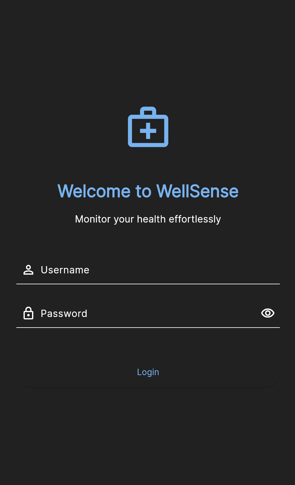
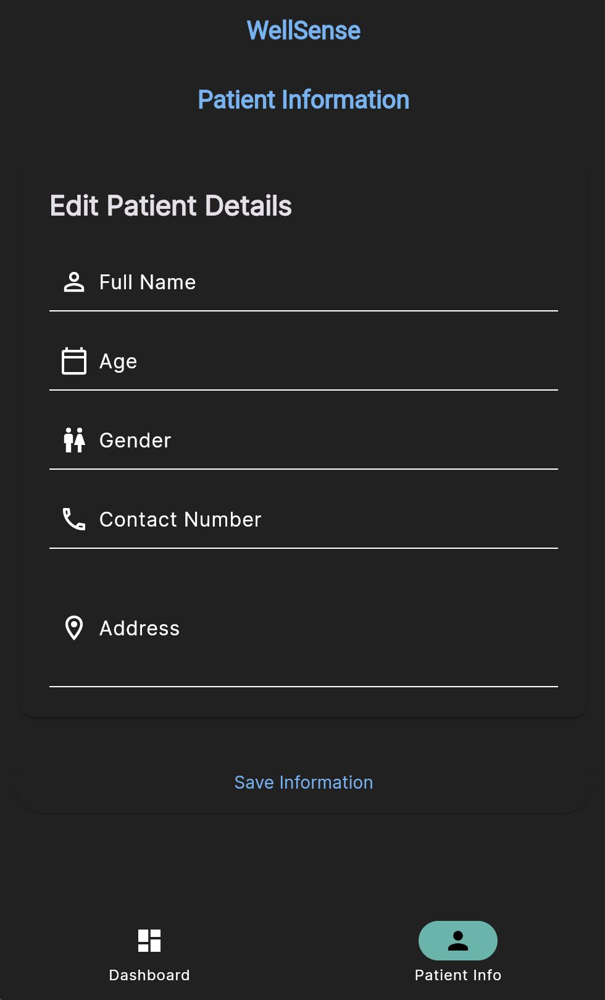
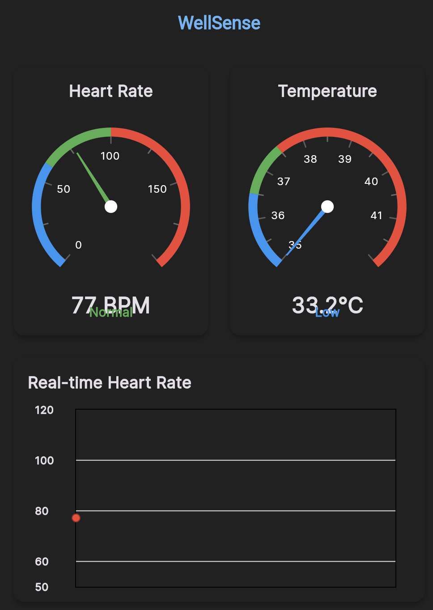
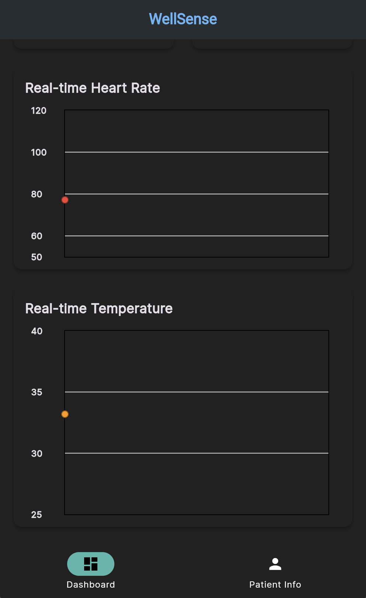
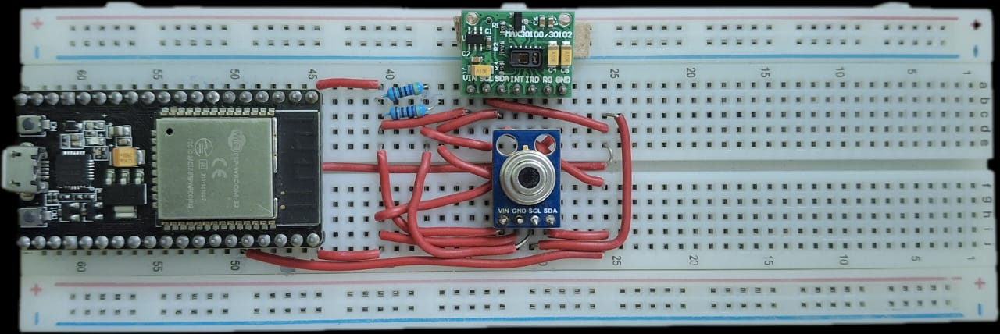

# WellSense Health Monitoring System

## Overview

WellSense is an IoT-based health monitoring system that measures vital signs including heart rate and body temperature in real-time. It uses ESP32 microcontroller along with specialized sensors and sends the collected data to a Firebase real-time database, which is then displayed through a Flutter mobile application for remote monitoring and analysis.

## ✨ Features

- **Real-time Vital Monitoring**: Live heart rate tracking with visual heartbeat animation
- **Temperature Analysis**: Body temperature tracking with color-coded status indicators
- **Device Management**: Battery status monitoring for the ESP32 hardware
- **Responsive Design**: Optimized for phones, tablets, and desktop
- **Offline Capability**: Local data caching when internet connection is unavailable
- **Secure Authentication**: User login and data protection
- **Automatic detection** of finger presence on the sensor
- **Simulated physiological variations** for realistic heart rate readings

## System Implementation

### Mobile Application

<div align="center">
  
  
  
  
</div>

### Hardware Implementation

<div align="center">
  
  
</div>

## 🛠 Tech Stack

- **Frontend**: Flutter, Dart
- **Backend**: Firebase Realtime Database
- **Hardware**: ESP32 with health sensors
- **Authentication**: Firebase Authentication

## 🏗 Architecture

WellSense follows a clean architecture pattern with separation of concerns:
- **Presentation Layer**: UI components and screens
- **Data Layer**: Repository pattern for data access
- **Device Layer**: ESP32 communication and sensor integration

## Hardware Requirements

- ESP32 development board
- MAX30102 Pulse Oximeter and Heart Rate Sensor
- MLX90614 Infrared Temperature Sensor
- 4.7kΩ pull-up resistors (4x) for I2C lines
- Jumper wires
- Power supply (USB cable or battery)

## Software Dependencies

The following Arduino libraries are required:

- Wire.h (Arduino I2C library)
- WiFi.h
- Firebase_ESP_Client.h
- MAX30105.h (for MAX30102 sensor)
- Adafruit_MLX90614.h

## Installation

### Mobile App Prerequisites

- Flutter SDK (latest version)
- Firebase account
- ESP32 development board with sensors
- Android Studio / VS Code with Flutter extensions
- Git

### Firebase Configuration

1. Create a new Firebase project at [Firebase Console](https://console.firebase.google.com/)
2. Enable Realtime Database
3. Set up your security rules for production use
4. Add your application platforms:
   - For Android: Generate and download `google-services.json` to `android/app/`
   - For iOS: Generate and download `GoogleService-Info.plist` to `ios/Runner/`

### Hardware Setup
1. **Install Required Libraries**
   - Open Arduino IDE
   - Go to Sketch > Include Library > Manage Libraries
   - Search for and install the required libraries

2. **Hardware Setup**
   - Connect the sensors according to the wiring diagram
   - Power the ESP32 board using USB or external power supply

3. **Software Setup**
   - Configure WiFi and Firebase credentials in the Arduino code

## Usage

### Mobile App
1. Launch the WellSense app
2. Log in with your credentials
3. Connect to your ESP32 device by entering the device ID
4. View real-time health metrics on the dashboard
5. Navigate to the History tab to view past records

### Hardware Device
1. Power on the device
2. The device will automatically connect to WiFi and Firebase
3. Place your finger on the MAX30102 sensor
4. The system will begin measuring heart rate and temperature
5. Data will be sent to Firebase in real-time

## Firebase Database Structure

The application stores data in the following structure:

```
/sensor
  /livedata
    - heartRate: float
    - temperature: float
    - timestamp: long
  /status
    - status: string
    - timestamp: long
```

## Troubleshooting

- **Sensors not detected**: Check wiring connections and I2C address
- **WiFi connection issues**: Verify SSID and password
- **Firebase connection fails**: Check API key, database URL, and authentication credentials
- **Erratic readings**: Ensure finger is placed properly on the sensor without applying too much pressure 