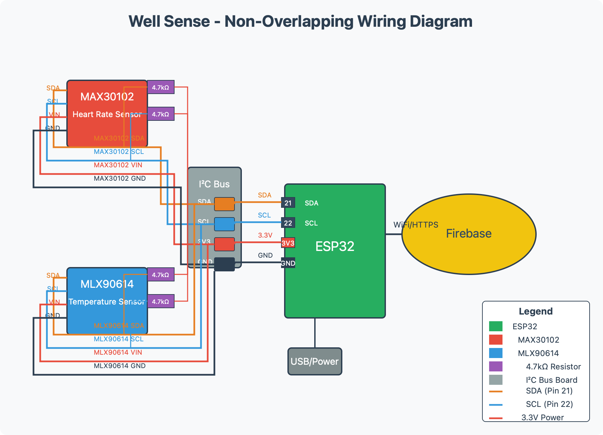

# WellSense Hardware Setup Guide

## Components Required

- ESP32 development board
- MAX30102 Pulse Oximeter and Heart Rate Sensor
- MLX90614 Infrared Temperature Sensor
- 4.7kΩ pull-up resistors (4x) for I2C lines
- Jumper wires
- Power supply (USB cable or battery)

## Wiring Diagram

## Connections

| ESP32 | MAX30102 | MLX90614 |
|-------|----------|----------|
| 3.3V  | VIN      | VIN      |
| GND   | GND      | GND      |
| D21   | SDA      | SDA      |
| D22   | SCL      | SCL      |

## Software Setup

1. Install the following Arduino libraries:
   - Wire.h (Arduino I2C library)
   - WiFi.h
   - Firebase_ESP_Client.h
   - MAX30105.h (for MAX30102 sensor)
   - Adafruit_MLX90614.h

2. Configure your WiFi credentials and Firebase configuration in the Arduino code.

3. Upload the code to your ESP32 board.

4. Verify the connection by checking the serial monitor output.

## Troubleshooting

- **Sensors not detected**: Check wiring connections and I2C address
- **WiFi connection issues**: Verify SSID and password
- **Firebase connection fails**: Check API key, database URL, and authentication credentials
- **Erratic readings**: Ensure finger is placed properly on the sensor without applying too much pressure 